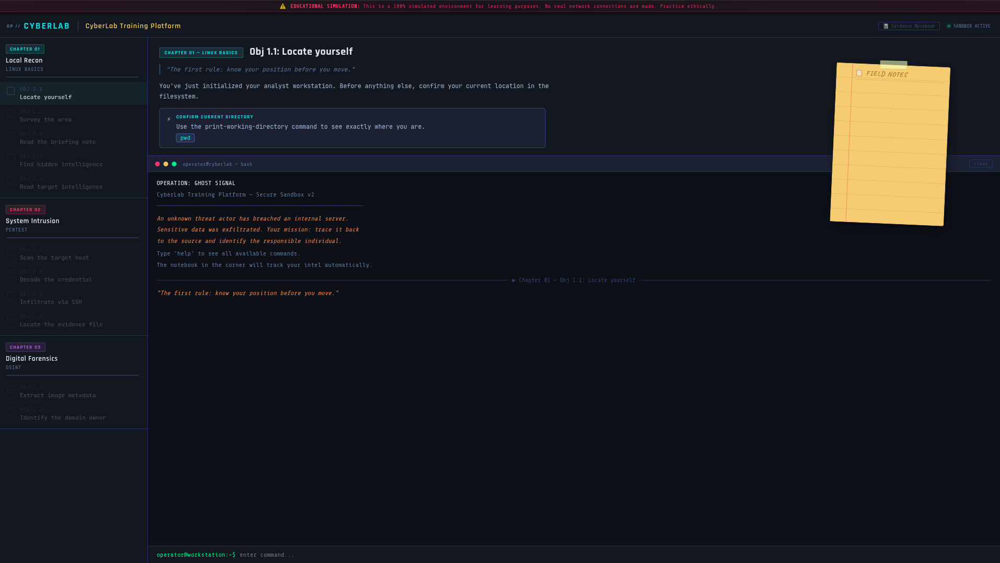

# 🕵️‍♂️ CyberLab — Investigative Terminal Simulator

### 📌 What Is This?

**CyberLab** is a focused, web-based terminal simulation designed to model the logical progression of a digital forensic investigation. 

The core challenge it addresses: **How to connect disparate pieces of information—IPs, metadata, and credentials—into a cohesive narrative of a security breach.**

Built entirely with **Vanilla JavaScript**, it provides a safe, sandboxed environment to practice the "mental model" of a security analyst. It doesn't use real network connections; instead, it simulates the behavior of standard Linux and Security tools to teach the underlying workflow of a cyber investigation.

---

[](https://alga93.itch.io/cyberlab)

---



---


### 🎯 The Problem This Explores

Learning cybersecurity often feels fragmented. You learn a tool (like `nmap`), but not necessarily *why* or *when* to use it in a broader context. 

**CyberLab addresses this with a structured, 3-stage investigation:**
*   **Reconnaissance:** Finding hidden entry points in a local filesystem.
*   **Network Intrusion:** Port scanning and credential harvesting to pivot to a remote target.
*   **Attribution (OSINT/Forensics):** Using file metadata and registry lookups to identify the threat actor.

The project prioritizes **UX Fluidity**: unlike traditional CTFs that require manual navigation, CyberLab features an "Evidence Notebook" that automatically logs critical findings, allowing the user to focus on the logic rather than rote memorization.

---

### 🧠 Architecture & Tech Stack

The project follows a "Single-File Application" philosophy for maximum portability and zero-dependency execution.

*   **Frontend:** Vanilla HTML5 / CSS3 (Custom Properties for dynamic UI states).
*   **Engine:** Vanilla JavaScript (State-managed terminal emulator).
*   **Persistence:** `localStorage` integration to save mission progress.
*   **Visuals:** Google Fonts integration ('Anonymous Pro' for the terminal, 'Caveat' for the notebook).

---

### 🛠️ Key Features

*   **Evidence Notebook:** A fixed visual element styled as a "legal pad" that automatically records IPs, passwords, and suspect names as they are discovered.
*   **Seamless Progression:** Successful command execution triggers the next mission phase automatically, maintaining terminal history for a realistic "paper trail."
*   **Monospaced Immersion:** Custom CSS to simulate a CRT-style terminal with auto-scrolling and command validation.
*   **Stateful Memory:** Even if the browser is refreshed, the user remains at their current mission stage.

---

### 🚀 Quick Start

Since this is a client-side simulation, no installation is required.

1.  **Clone the repository:**
    ```bash
    git clone [https://github.com/andreluizgreboge/cyberlab.git](https://github.com/andreluizgreboge/cyberlab.git)
    ```
2.  **Open the lab:**
    Simply open `index.html` in any modern web browser.

---

## 📄 License
This tool is for informational and educational purposes only. Data is provided by the USGS.

Developed by Andre Luiz Greboge.

This project is licensed under the MIT License - see the [LICENSE](LICENSE) file for details.

    
